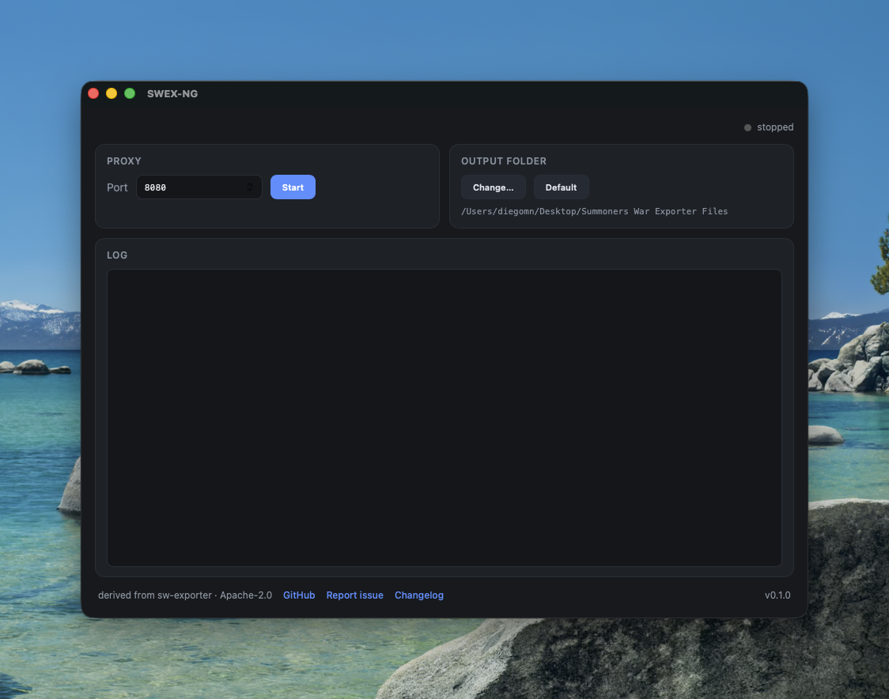

<div align="center">

# SWEX-NG

**Native macOS Summoners War profile exporter — Tauri 2 + React 19 + Rust.**

[](https://github.com/diegomnDev/swex-ng/actions/workflows/ci.yml)
[](https://github.com/diegomnDev/swex-ng/releases)
[](https://github.com/diegomnDev/swex-ng/releases)
[](LICENSE)


A modern, **native** reimplementation of [Summoner's War Exporter](https://github.com/Xzandro/sw-exporter):
it intercepts the game's `gateway_c2.php` call, decrypts it, and saves your profile
JSON — but built for Apple Silicon, with the macOS set-up fully automated.



</div>

## Why

The original SWEX is excellent, but on a modern Mac it shows its age:

- It's **Electron** + a **precompiled x64 native addon** for the decrypt key — no
  `arm64` build existed, so it ran under **Rosetta** on Apple Silicon.
- It made you **trust a certificate in Keychain and set the system proxy by hand**.

SWEX-NG fixes all three:

- **Native arm64 (and Intel).** The decrypt is pure Rust (`aes` + `cbc` + `flate2`),
  so the binary is architecture-independent — **no Rosetta**.
- **No Electron / Chromium.** Tauri shell (system WebView + Rust core) — a few MB
  instead of ~150.
- **Zero manual macOS setup.** It trusts its own CA (user login keychain, silently,
  no admin) and sets/clears the system HTTPS proxy itself. No Keychain steps, no Proxyman.
- **In-app auto-updates**, signature-verified, from GitHub Releases.

## How it maps to the original

| SWEX (original) | SWEX-NG |
| --- | --- |
| `http-mitm-proxy` | [`hudsucker`](https://crates.io/crates/hudsucker) (Rust MITM) |
| `node-forge` CA generation | [`rcgen`](https://crates.io/crates/rcgen) |
| native `smon_decryptor` addon | pure Rust `aes` + `cbc` + `flate2` (`src-tauri/src/decode.rs`) |
| `mapping.js` (~2350 lines) | embedded `mapping.json` + ported helpers (`mapping.rs`) |
| Electron + React 16 | Tauri 2 + React 19 + Vite 6 |
| manual Keychain + Network proxy | `security` + `networksetup`, automated (`macos.rs`) |

## Install

1. Download the latest **`.dmg`** from [Releases](https://github.com/diegomnDev/swex-ng/releases).
2. Drag **SWEX-NG** into Applications.
3. The app is **not Apple-signed** yet, so the first launch is gated by Gatekeeper.
   Either **right-click the app → Open**, or run once:
   ```bash
   xattr -dr com.apple.quarantine /Applications/SWEX-NG.app
   ```
   Every update after that installs in-app, with no warning.

## The one thing you provide: your decryption key

The 16-byte AES key is **not in this repo** — it belongs to the game and lived inside
the original's precompiled addon. Extract it **once** from your existing, working SWEX
checkout:

```bash
./node_modules/.bin/electron -e "console.log(require('./app/proxy/binaries/key-darwin-x64.node').key().toString('hex'))"
```

That prints 32 hex characters. Paste them into SWEX-NG's **Decryption key** field
(stored locally in the app's data dir, **never committed, never sent anywhere**), or
set `SWEX_KEY=<hex>` in the environment.

## Using it

1. Paste the key (first launch only).
2. *(Optional)* pick an **Output folder** — defaults to the app's data dir.
3. Set a port (default 8080) and click **Start proxy**. macOS is configured
   automatically — no password, no prompts.
4. Open Summoners War and wait for the login / "Press Any Button" screen.
5. Your profile is decrypted and saved as `{wizard_name}-{wizard_id}.json`; the UI
   shows monster/rune counts and a button to open the folder.
6. Click **Stop proxy** — or just quit; the system proxy is restored automatically
   either way.

Only `*.qpyou.cn` traffic is intercepted; everything else is tunnelled untouched
(same surgical behaviour as the original — your other apps are unaffected).

### World Guild Battle defense (a small extra)

Your WGB defense teams aren't part of the login payload — the game only sends them when
you open the **WGB defense** screen. Open it once while the proxy is running and SWEX-NG
merges those teams (with full rune/artifact builds) into the same profile file under a
`guildwar_defense` key. The original Summoners War Exporter doesn't capture this — it's a
small bonus on top of full profile parity, not a competition.

## Build from source

**Prerequisites:** [Rust](https://rustup.rs) (stable), Node 20 + `pnpm`,
`cmake` (`brew install cmake`, needed by `aws-lc-rs`), Xcode Command Line Tools.

```bash
pnpm install
pnpm tauri dev      # development
pnpm tauri build    # native .app / .dmg
```

Tests: `cargo test --manifest-path src-tauri/Cargo.toml`.

## Roadmap

- [ ] **Linux / Windows** — the proxy + decrypt core is cross-platform; what's missing
  is each OS's cert-trust + system-proxy module (the macOS one lives in `macos.rs`).
- [ ] **Apple notarization** for friction-free installs (needs an Apple Developer ID).
- [ ] **Rune optimizer** built on the bonus `monster_name` / `rune_efficiency` commands.

## Security & privacy

Your key and your profiles **never leave your machine**. The proxy intercepts **only**
`*.qpyou.cn` and tunnels everything else untouched. See [SECURITY.md](SECURITY.md).

## Credits & license

Protocol behaviour and the mapping data are derived from
[Xzandro/sw-exporter](https://github.com/Xzandro/sw-exporter) (Apache-2.0). SWEX-NG is
released under **Apache-2.0** — see [LICENSE](LICENSE) and [NOTICE](NOTICE).

## Legal & disclaimer

SWEX-NG is an **independent, fan-made, non-commercial** tool. It is **not affiliated
with, endorsed by, or sponsored by Com2uS Corp.** "Summoners War" and all related
names and assets are trademarks of their respective owners, referenced here only
descriptively.

- **Purpose.** For **personal and educational use** — exporting **your own** account
  data, which the game server already sent to your own client. It does not modify the
  game, access other players' data, bypass any purchase, or grant any in-game advantage.
- **Your responsibility.** Decrypting game traffic may be against the game's Terms of
  Service. **You use this tool at your own risk** and are solely responsible for
  complying with those Terms. The authors accept no liability for how you use it.
- **No keys included.** The decryption key is **not** distributed with this project. You
  supply your own, extracted from your own existing installation; it never leaves your
  machine.
- **No warranty.** Provided "as is", without warranty of any kind (see the Apache-2.0
  LICENSE).
- **Takedown.** This is a good-faith community project. If a rights holder believes it
  infringes their rights, open an issue or contact the maintainer and it will be
  addressed promptly, including removal if warranted.

See also [DISCLAIMER.md](DISCLAIMER.md).
